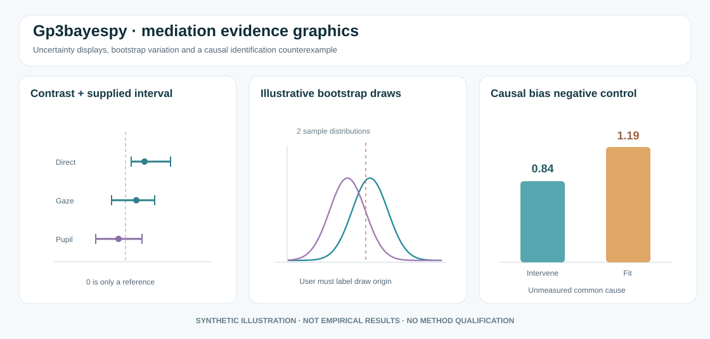

# Mediation estimation gallery: what the figures establish



*Original synthetic schematic. The effect intervals and density sketches are not computed from package posterior draws, nor do they represent empirical study results.*

## Forest plots need uncertainty provenance

An effect estimate with an interval is useful only when the reader knows **which** estimand, interval method, level of clustering and model generated it. A frequentist percentile-bootstrap interval is not automatically a Bayesian credible interval. Neither is an identified causal indirect effect merely because a numerical effect estimate appears in the same figure.

The experimental [functional-form audit in PR #18](https://github.com/stefanosbalaskas/gp3bayespy/pull/18) is frequentist, with participant-cluster refits, and is intentionally **not** an inference engine for Bayesian natural effects.

## Visualise effect-size uncertainty, not only a significance flag

```python
import numpy as np
import matplotlib.pyplot as plt

# Illustration only: supplied contrast and interval values, not model output.
labels = ["Direct association", "Gaze pathway", "Pupil pathway"]
estimate = np.array([.18, .12, -.03])
lower = np.array([.04, .02, -.12])
upper = np.array([.32, .23, .07])
xerr = np.vstack([estimate - lower, upper - estimate])
fig, ax = plt.subplots(figsize=(7, 3.5))
ax.errorbar(estimate, labels, xerr=xerr, fmt="o", capsize=3)
ax.axvline(0, color="grey", linestyle="--")
ax.set(xlabel="Illustrative effect with explicitly supplied interval",
       title="Interval visualisation does not identify its uncertainty type")
plt.show()
```

A DABEST-like raw-outcome visualization is best suited to a prespecified unadjusted participant-level contrast. If the inferential target is a random-effects GLMM contrast, mediation estimand or longitudinal trajectory, use posterior or bootstrap summaries computed from that **same** model rather than replacing them with independent-frame means. See the [R gp3bayes figure gallery](https://github.com/stefanosbalaskas/gp3bayes/pull/30) and the established [DABEST project](https://acclab.github.io/DABEST-python/).

## Why an exact nonlinear regression fit does not prove mediation causality

A known-truth benchmark contrasts two quantities under the constructed system:

- Mediator: `M = 0.4 + 0.7 X + U`
- Outcome: `Y = 1 + 0.2 X + 0.6 M + 0.4 M**2 + 0.5 U`

The controlled mediator shift when the common cause `U` is fixed equals **0.84**. A quadratic observational mediator-outcome model that omits `U` instead yields **1.19**, a difference of 0.35. Correctly recovering the observed nonlinear regression does not recover the causal intervention in the presence of unmeasured mediator-outcome confounding.

```python
import matplotlib.pyplot as plt

labels = ["Controlled intervention", "Model-based observational shift"]
values = [.84, 1.19]
fig, ax = plt.subplots(figsize=(7, 3.5))
bars = ax.bar(labels, values)
ax.bar_label(bars, fmt="%.2f")
ax.set(ylabel="Constructed mediator-shift contrast",
       title="Synthetic counterexample: observational contrast is not causal")
plt.show()
```

This is a deterministic **negative control** for overinterpretation, not empirical causal evidence. It cannot replace sequential exchangeability arguments, physical measurement validity or mediation sensitivity analysis.

## Audit before publication

Report (a) causal diagram assumptions and equivalence-class uncertainty, (b) the actual effect estimand, (c) participant/trial hierarchy, (d) which distribution generated the draws, (e) nonlinear model sensitivity, (f) missingness and confounding assumptions, and (g) interval calibration.

**Status:** documentation-only educational illustration. The scientific qualification and release decisions for experimental APIs remain separate. No new PyPI version is implied.
