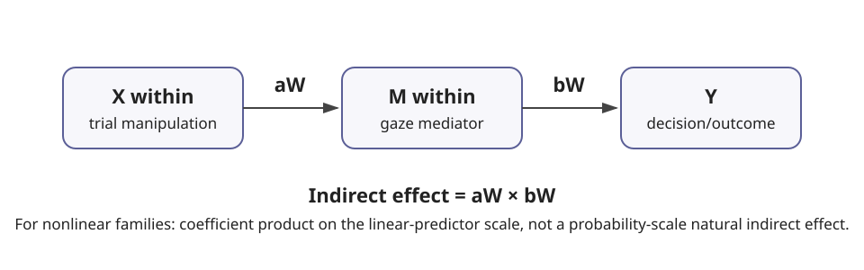

# Bayesian multilevel gaze mediation

## Method overview

`gp3bayespy` fits the inferential layer after `eyeprocesspy` has prepared a canonical repeated-measures mediation object. The simple model separates within- and between-participant paths:

```text
Mediator:
M_ij ~ a_W X_within_ij + a_B X_between_i + participant effects

Outcome:
Y_ij ~ c'_W X_within_ij + b_W M_within_ij
     + c'_B X_between_i + b_B M_between_i
     + participant effects
```

The primary estimand is the within-participant posterior product `a_W × b_W` on the **linear-predictor product scale**. A between-participant product `a_B × b_B` is returned only when the observed design contains enough between-person variation to identify both constituent paths; balanced within-subject manipulations often make `X_between` constant.

## Supported families

Mediator families: Gaussian, lognormal, Gamma, beta, Bernoulli, Poisson, and negative binomial.

Outcome families: Gaussian, Bernoulli/logistic, Poisson, negative binomial, and ordinal when supported by the backend.

The package does not coerce gaze variables to Gaussian merely for convenience.

## First model

```python
from gp3bayespy import (
    create_mediation_prior_specification,
    fit_multilevel_gaze_mediation,
    estimate_within_indirect_effect,
)

priors = create_mediation_prior_specification(
    intercept_sd=2.5,
    coefficient_sd=1.0,
    group_sd_scale=1.0,
)

fit = fit_multilevel_gaze_mediation(
    prepared,
    mediator_family="lognormal",
    outcome_family="bernoulli",
    priors=priors,
    random_slopes=("mediator_x", "outcome_m"),
    missingness_policy="quality_eligible",
    chains=4,
    draws=1000,
    tune=1000,
    seed=2026,
)

indirect = estimate_within_indirect_effect(fit)
```

## Missingness is explicit

The default `missingness_policy="error"` blocks fitting when incomplete or quality-ineligible rows are present. Analysts must choose `complete_case` or `quality_eligible` explicitly after reviewing the eyeprocesspy audits. Excluded row positions are stored in the model specification.

## Convergence is a gate

`check_mediation_convergence()` evaluates R-hat, bulk ESS, divergences, and maximum-tree-depth hits. Indirect-effect extraction fails by default when the convergence gate fails. `require_convergence=False` exists for diagnostic inspection, not for substantive reporting.

## Nonlinear outcomes

For Bernoulli, ordinal, and count outcomes, the coefficient product is on the model's linear-predictor scale. It must not be described as a probability-scale natural indirect effect. Probability-scale mediation requires a separate counterfactual/predictive estimand and additional assumptions.

## Use / do not use

Use this model when repeated trial-level mediator and outcome measurements exist and the temporal/mechanistic ordering is defensible. Do not use it to manufacture a causal mechanism from cross-sectional correlations, or when the trial-level mediator is measured after the outcome.

## Visual interpretation



This is a deterministic synthetic illustration of the **linear-predictor product scale**, not a posterior from a real study. In an actual analysis the plotted distribution must come from the fitted model and is blocked from substantive reporting when critical convergence checks fail.

## Method guide

- [Worked AI-advice example](worked-example.md)
- [Choosing mediator and outcome families](family-selection.md)
- [Interpretation and estimands](interpretation-and-estimands.md)
- [Assumptions and limitations](assumptions-and-limitations.md)
- [Diagnostics and priors](diagnostics-and-priors.md)
- [Worked prior-sensitivity example](prior-sensitivity-worked-example.md)
- [Model comparison for mediation](model-comparison.md)
- [Serial and moderated extensions](serial-and-moderated.md)
- [Reporting guidance](reporting.md)
- [Worked reporting example](reporting-example.md)
- [Troubleshooting](troubleshooting.md)
- [API map](reference.md)


## Runnable examples

- `examples/multilevel_gaze_mediation_contract.py` demonstrates the deterministic preparation → prior → specification contract without sampling.
- `examples/multilevel_gaze_mediation_failure_cases.py` demonstrates the explicit missingness gate and a balanced within-subject design where between-X paths are not estimable.
- `examples/multilevel_gaze_mediation_prior_sensitivity_contract.py` holds the data/model contract fixed while varying a declared coefficient-prior scale.

These examples are synthetic and CI-small. Posterior examples belong in backend-enabled validation because sampling must never be faked.
